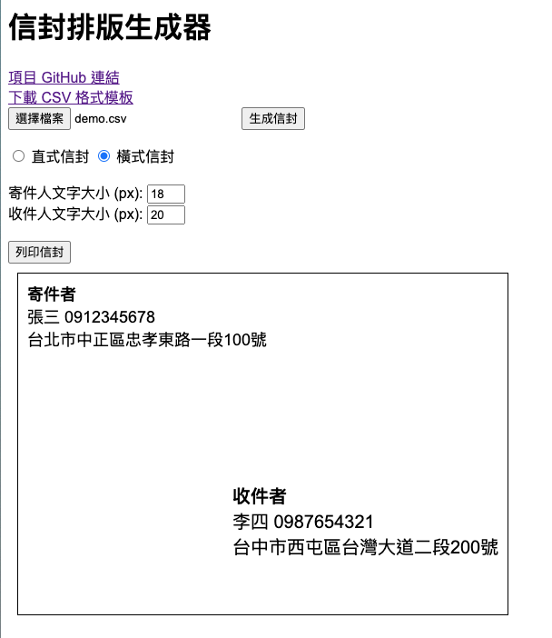

# 台灣信封排版生成器

純前端工具，可**手動輸入**或**匯入 CSV**，一鍵產出符合中華郵政格式、可直接列印郵寄的台灣信封（橫式 / 直式）。

🔗 線上版：https://oliver0804.github.io/Evnelope/



## 功能特色

- ✍️ **手動輸入**：直接在頁面填寫寄件人 / 收件人資訊，可新增、編輯、刪除清單項目。
- 📥 **CSV 匯入**：支援點選或拖曳上傳，並相容新舊兩種欄位格式。
- 📮 **郵遞區號**：獨立欄位呈現；若未填寫，會自動從地址開頭數字抽取。
- ↔️ **橫式 / 直式**：橫式為寄件人左上、收件人置中；直式採直書、收件人居中、寄件人左下，符合台灣信封慣例。
- 📐 **多種信封尺寸**：西式 DL / 12K、中式 2 號 / 3 號、A4 四格草稿，並支援**自訂寬高 (mm)**。
- 🔠 **字級調整**：分別即時調整寄件人 / 收件人文字大小。
- 🖼️ **自訂標誌 Logo**：可上傳公司 / 個人標誌，顯示於寄件人資訊上方並調整大小（僅存本機）。
- 🖨️ **兩種列印方式**：
  - *自動拼版*：多封信封排在同一張 A4 上，**省紙**、適合校稿或印出後裝入信封。
  - *每封一頁*：紙張尺寸自動設成信封大小，可直接把實體信封送入印表機列印、完美對齊。
- 🎨 **即時預覽**：所有設定即時反映，預覽自動縮放以符合畫面。
- 🔒 **本機記憶**：清單與版面設定會以 `localStorage` 自動儲存在使用者「這台電腦」的瀏覽器中，下次開啟自動還原；資料不會上傳伺服器，換電腦或清除瀏覽器資料即清空。

## 使用方法

1. 在「手動輸入」填寫資料後按「新增到清單」，或於「匯入 CSV」上傳檔案。
2. 在「版面設定」選擇信封方向、尺寸與字級。
3. 於右側清單確認 / 編輯內容，並查看列印預覽。
4. 按「列印信封」即可列印。

## CSV 格式

第一列為標題列。**新格式（含郵遞區號）**：

```csv
寄件人郵遞區號,寄件人姓名,寄件人地址,寄件人電話,收件人郵遞區號,收件人姓名,收件人地址,收件人電話
100,王小明,台北市中正區忠孝東路一段100號,0912345678,407,李大華,台中市西屯區台灣大道二段200號,0987654321
```

亦相容**舊格式（不含郵遞區號）**：

```csv
寄件人姓名,寄件人地址,寄件人電話,收件人姓名,收件人地址,收件人電話
張三,台北市中正區忠孝東路一段100號,0912345678,李四,台中市西屯區台灣大道二段200號,0987654321
```

> 可點頁面右上角「下載 CSV 模板」取得範例檔。

## 開發

純 HTML / CSS / JavaScript，無需建置流程。直接以瀏覽器開啟 `index.html` 即可。

| 檔案 | 說明 |
| --- | --- |
| `index.html` | 頁面結構與輸入介面 |
| `styles.css` | 介面樣式與信封 / 列印排版 |
| `script.js` | 表單、清單、CSV 解析與信封產生邏輯 |

## 聯絡方式

如有任何問題，歡迎於 GitHub 開 Issue。
